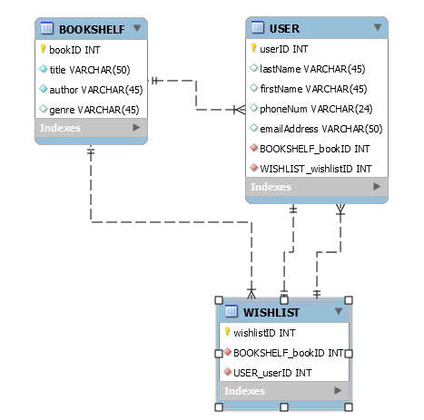

# Super Duper Bookclub

## Description

This is the second project/fifthteenth assigment from the UConn Coding Boot Camp curriculum.

View the deployed app [here](heroku link)

## Table of Contents

- [Goals](#goals)
- [Technologies Used](#technologies-used)
- [Instructions](#instructions)
- [File Structure ](#file-structure)
- [User Story](#user-story)
- [Acceptance Criteria](#acceptance-criteria)
- [Business Context](#business-context)
- [Definitions](#definitions)
- [Installation](#installation)
- [Usage](#usage)
- [Credits](#credits)
- [Contributors](#contributors)
- [License](#license)

## Goals

1. Inspect starter code within the `Develop` folder.

2. Get an understanding of each file's responsibility.

3. Create a GoogleDoc

4. Write a tutorial explaining _every_ file and its purpose [in GoogleDoc] .

5. Add instructions for how you could add changes to it [at end of tutorial in GoogleDoc].

## Technologies Used

- Node.js
- Express.js
- Handlebars
- MySQL
- Sequelize
- ESLint
- Travis CI
- Framebox

## Instructions

### File Structure

```
.Develop
|
├── config
│   └── middleware
|    |  ├── isAuthenticated.js
|    ├── config.json
|    └── passport.js
│
├── models
│   └── index.js
|   └── user.js
│
├── public
│   └── js
|   |   ├────login.js
|   |   ├──── members.js
|   |   └──── signup.js
|   └── stylesheets
│       └── style.css
│
├── routes
|    ├── api-routes.js
|    └── html-routes.js
│
├── (node_modules)
├── (.gitignore)
├── (package-lock.json)
|
├── package.json
|
├── server.js
│

```

## Table Model



### User Story

```
AS A
I WANT
SO THAT

```

### Acceptance Criteria

The application must meet the following requirements:

```
GIVEN
WHEN
THEN

```

### Business Context

## Installation

1. Create a .gitignore file:

   - type `node_modules` in first line
   - type `.DS_Store` in second line

2. Create a new **package.json** file:

   - Initialize `npm`: `npm init`. This will be used to set up a new or existing npm package. You can customize the fields, or you can continue to press the enter key until you see `0 vulnerabilities`.
   - This will create a `package.json` file and a `package-lock.json` file.
   - Install the Inquirer package using: `npm install inquirer`
   - This will create a `node_modules` file.
   - You are now ready to create your `index.js` file: `touch server.js`

<!--1.

3. Set up Inquirer package within your newly created `server.js` file.

```
const inquirer = require('inquirer');
const fs = require("fs");
const util = require("util");
```

7. Copy and paste the code (or fork it) from the `server.js` within this repository.

8. Save file. Run `server.js` file within terminal using `node server.js`

9. If working, answer the prompts by entering your own inputs via the command line.
   -->

### Definitions

The goals above and the tutorial can be further understood with the following definitions:

**MySQL**
: the most popular Structured Query Language (SQL) database with a relational structure.

**relational database**
: a collection of data stored electronically that stores and finds data based on its relationship to other data in the database. Relational databases are tabular, meaning that data is stored in tables composed of rows and columns, much like a spreadsheet.

**CRUD**
: functions that Create Render Update Delete

**Primary Keys**
: aka primary keyword, a key in a relational database that is unique for each record; a unique identifier, such as a telephone number; a relational database must always have one and only one primary key.

**Foreign Keys**
: a column or group of columns in a relational database table that provides a link between data in two tables; acts as a cross-reference between tables because it references the primary key of another table, thereby establishing a link between them.

**Joins**
: command that joins two or more tables and the specified data and combines the data

## Usage


## Credits

Reference articles:

## Contributors

[Mike Henson](https://github.com/MikeH138)

[Peter Izzo](https://github.com/peter-izzo)

[Penny Quirinio](https://github.com/pennyquirino)

[Dana Smooke](https://github.com/dsmooke)

## License

[MIT](MITLicense.txt)

---

© 2021 Trilogy Education Services, LLC, a 2U, Inc. brand. Confidential and Proprietary. All Rights Reserved.
