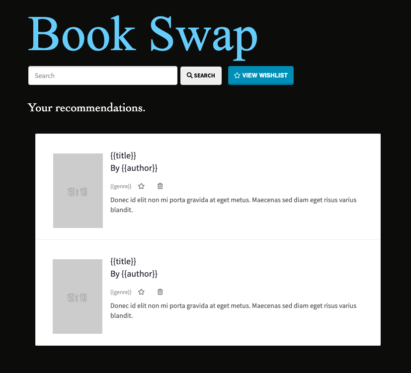

# Super Duper Bookclub


## Description

This is the second project (fifthteenth assigment) from the UConn Coding Boot Camp curriculum.

View the deployed app [here](heroku link)

## Table of Contents

- [Goals](#goals)
- [Technologies Used](#technologies-used)
- [Instructions](#instructions)
- [File Structure ](#file-structure)
- [User Story](#user-story)
- [Acceptance Criteria](#acceptance-criteria)
- [Presentation Requirements](#presentation-requirements)
- [Definitions](#definitions)
- [Installation](#installation)
- [Usage](#usage)
- [Credits](#credits)
- [Contributors](#contributors)
- [License](#license)

## Goals

1. Must use a Node and Express server

2. Must use Handlebars.js as the template engine

3. Must be backed by a MySQL database with a Sequelize ORM

4. Must utilize both GET and POST routes for retrieving and adding new data

5. Must be deployed using Heroku (with data)

6. Must utilize at least one new library, package, or technology that we haven’t discussed

7. Must have a polished front end/UI

8. Must have a folder structure that meets the MVC paradigm

9. Must meet good quality coding standards (indentation, scoping, naming)

10. Must protect API keys in Node with environment variables

## Technologies Used

- Node.js
- Express.js
- Handlebars
- MySQL
- Sequelize
- ESLint
- Travis CI
- Framebox

## Instructions

You and your team will design and build an app using the MVC paradigm and your own server-side API. You will also continue to add to your professional repertoire with testing, continuous integration and linting tools.

### File Structure

```
.Develop
|
├── config
│   ├── config.json
|   ├── connection.js
|   └── orm.js
│
├── models
│   └── book.js
|   └── index.js
│
├── public
|    ├── assets
|        └── css
│             └── style.css
|        └── imgs
│             └── book-covers
│        └── js
|           ├──── home-search.js
|           ├──── newScript.js
|           ├──── save-book.js
|           ├──── script.js
|           └──── wishlist.js
|
├── routes
|    ├── my-api-routes.js
|    └── html-routes.js
│
├── views
|     └── layout
|           └── main.handlebars
|     └── partials
|           └── recommendations.handlebars
|     ├──── index.handlebars
|     └──── wishlist.handlebars
|
├── node_modules
├── .gitignore
├── (.eslintignore)
├── .eslintrc.json
|
├── package.json
├── (package-lock.json)
|
├── server.js
│

```

## Process

### Workbench Table


### Wireframe


### User Story

```
AS A reader who is always looking for new book suggestions
I WANT an application that finds me book recommendations based on my search input
SO THAT I can save books that interest me AND refer to them when it's time for a new book

```

### Acceptance Criteria

The application must meet the following requirements:

```
GIVEN a book finding application that finds books based on user's selection
WHEN a user clicks on the link
THEN the application will open in Heroku
WHEN a user inputs a search criteria and clicks the search button
THEN the top three books related to the search input are displayed
WHEN a user clicks the save button
THEN the book will be saved to a Wishlist books
WHEN a user clicks the View Wishlist button
THEN the user will be directed to a page that displays all their saved books
WHEN a user clicks the remove button
THEN the book will be removed from the page
WHEN the user clicks on one of the books on the shelf
THEN a dropdown description of the book along with a site where they can purchase the book will display

WHEN the user examines the documentation of the application
THEN the user will see a folder structure that meets the MVC paradigm
WHEN the user examines the code of the application
THEN the user will see code that meets good quality coding standards

```

### Presentation Requirements


- Elevator pitch: a one minute description of your application

- Concept: What is your user story? What was your motivation for development?

- Process: What were the technologies used? How were tasks and roles broken down and assigned? What challenges did you encounter? What were your successes?

- Demo: Show your stuff!

- Directions for Future Development

- Links to to the deployed application and the GitHub repository. Use this guide for deploying your application to Heroku if you need a reminder on how to deploy!

## Installation

1. Create a new directory where you want to save the repo.

2. Clone this repo using the ssh-key for the code.

3. Clone this repo: `git clone ssh-key-of-Repo` into your project directory.

4. Open code in VS Code or another text-editor.

5. In an integrated terminal, run the code `node server.js`.

6. You can also run the app from Heroku.

### Definitions

The goals above and the tutorial can be further understood with the following definitions:

**Sequelize**
: the most popular Structured Query Language (SQL) database with a relational structure.

## Usage

Display of the bookshelf:


Recommendations based on the user's input will be displayed in the following way:



## Credits

Reference articles:
[w3schools - collapse](https://www.w3schools.com/bootstrap/tryit.asp?filename=trybs_ref_js_collapse_simple&stacked=h)

[multiple collapse buttons](https://stackoverflow.com/questions/63204909/bootstrap-multiple-collapse-items)

[FrameBox - wireframe renderer](http://framebox.org/ANIRG)

[ClickMinded - button generator](https://www.clickminded.com/button-generator/)

[Sequelize - Documentation](https://sequelize.org/master/class/lib/sequelize.js~Sequelize.html#instance-method-define)

## Contributors

[Mike Henson](https://github.com/MikeH138)

[Peter Izzo](https://github.com/peter-izzo)

[Penny Quirinio](https://github.com/pennyquirino)

[Dana Smooke](https://github.com/dsmooke)

## License

[MIT](MITLicense.txt)

---

© 2021 Trilogy Education Services, LLC, a 2U, Inc. brand. Confidential and Proprietary. All Rights Reserved.
